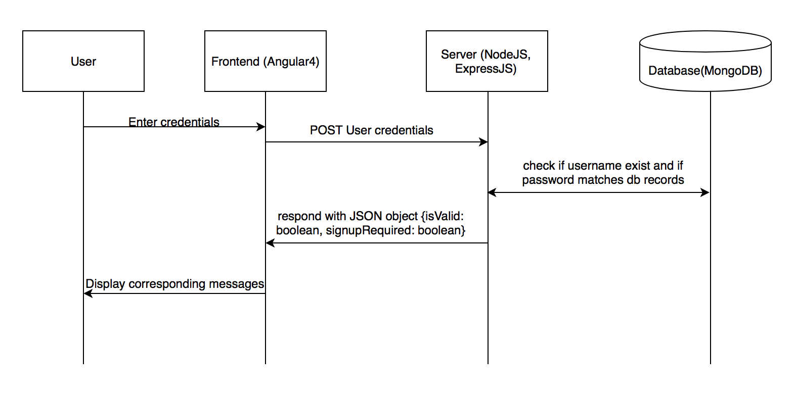
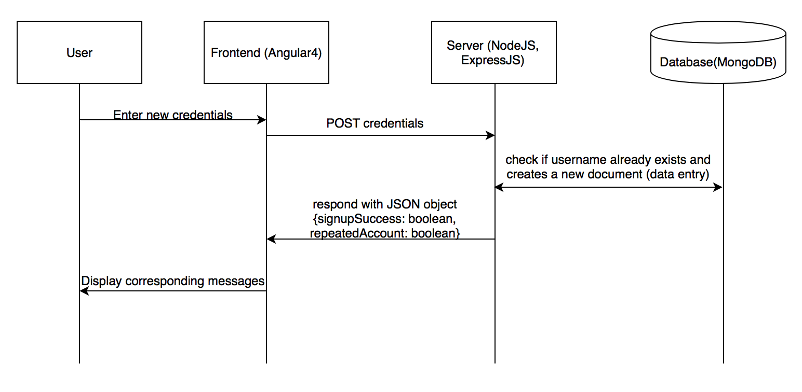
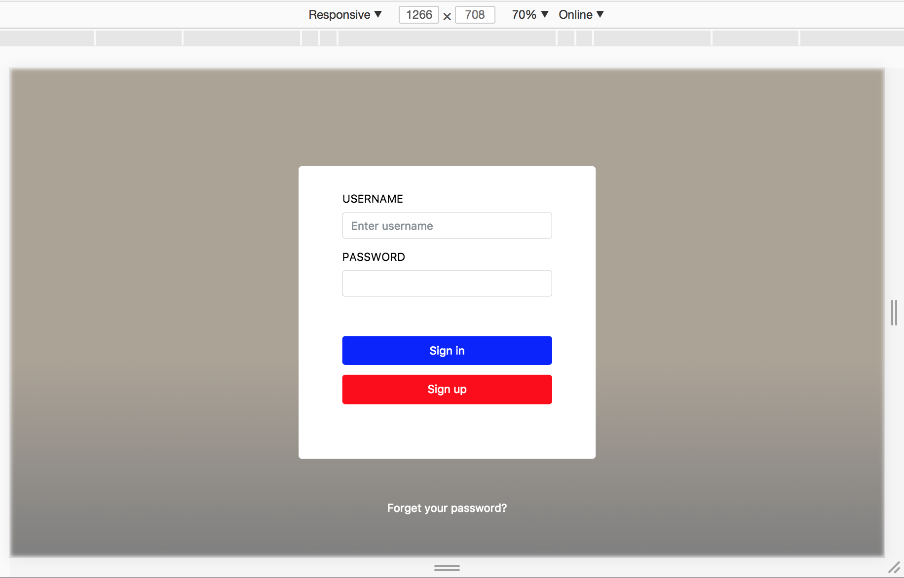
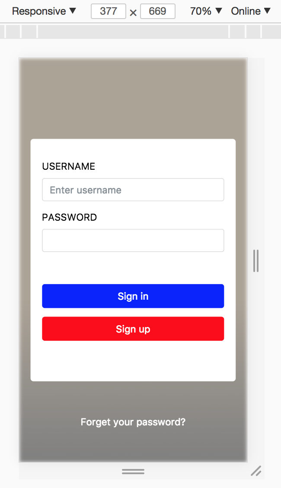

# MEAN Responsive Login Web App

**A demostration of a web app built by mean stack (MongoDB ExpressJS Angular4 NodeJS).**
  **[Login web app link](https://jay-shi-mean-login.firebaseapp.com "login web app")** 

## Demo Video:

## Architecture Flow:
#### Sign in

#### Sign up

## Use:
This web app is used as a example to show how a login web app can be build using MEAN stack. User can sign up a new account and the account data will be stored in database hosted online. Then users can log in the web app using the account they just signed up.

## RoadMap:
  - [x] 1. Build Responsive Angular4 login frontend
  - [x] 2. Add REST service components
  - [x] 3. Host Mongo database on Atlas and connect it to Nodejs Server
  - [x] 4. Deploy NodeJS server to Heroku
  - [x] 5. Deploy Angular web app to Firebase
  - [ ] 6. Automate builds using Travis CI
  - [ ] 7. Implement password hashing to server
  - [ ] 8. Unit tests on Angular frontend using Karma-Jasmine
  - [ ] 9. Unit tests on Nodejs server using Mocha, Chai and Sinon
  - [ ] 10. Integration Test using Protractor

## Main Frameworks, Dependencies and Dev Tools:
* **Frontend:** Angular4 in Typescript, HTML, CSS3, Bootstrap and Fontawesome
* **Server:** NodeJS, ExpressJs and Mongoose
* **Database:** MongoDB
* **Deployment:** Firebase, Heroku, Atlas, Travis
* **Dev Tools:** Aangular-CLI, Express-generator, Postman, Nodemon, Google Chrome Toolbar

## Responsive Frontend:
#### On Desktop

#### On Mobile Screen

## More details will be updated as the project progresses